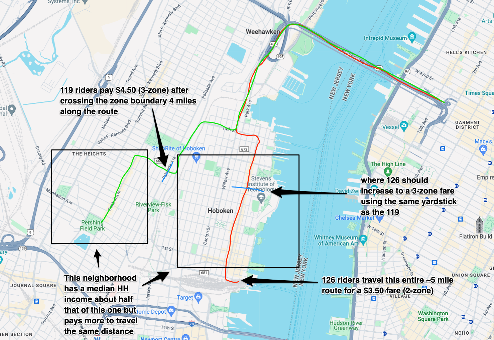

# Is NJTransit's Fare Zone Really Fair?

## The Problem

Bus services are the backbone of public transit in New Jersey. NJTransit operates the nation's 5th largest bus transit system, with dozens of lines serving more than 102 million passengers annually -- more than 39 million service by the agency's commuter and light rail services. [1]

However, the bus system relies on an antiquated zone system for determining fares. Not only is the source of needless complexity for passengers and drivers alike, the arbitrary design of these zones may be masking hidden inequities.

Two heavily-travelled interstate commuter bus routes in Hudson County illustrate how stark these inequities can be.

**Route 126** connects Hoboken Terminal and the Port Authority Bus Terminal, serving a ridership of mostly white, affluent professionals. Travelling the entire 4.8 mile length of this route require a 2-zone ticket, costing $3.50 (January 2024).

**Route 119** connects Bayonne and the Port Authority Bus Terminal, via Jersey City's Journal Square Transportation Center, serving a mostly non-white working class ridership. The per-capita income along this route is about half of the areas served by the 126. However, the 2-zone fare boundary (at Palisade Avenue in Jersey City Heights) on this route is only 4 miles along the route. That means thousands of lower-income, non-white commuters throughout Jersey City Heights pay a higher 3-zone fare ($4.590) than their neighbors in Hoboken travelling **the same distance** on Route 126.

Do these kinds of fare inequities exist elsewhere in the NJTransit system? Do they constitute a violation of [NJTransit's non-discrimination obligations](https://www.njtransit.com/about-us/civil-rights-diversity/title-vi-civil-right-act-1964-amended) under Title VI of the Civil Rights Act?




## The Data

### NJTransit Route and Fare Zone Geometry

Two map layers (current through Nov. 23, 2023) were obtained via an Open Public Records Act request, fulfilled on 11 Jan 2024. No metadata was provided.

- `BUS_NJT_23Nov` - route geometry. Unclear how this differs, if at all from route map geometry available in public GTFS data set. Presumably, this is the master used to produce those, and may contain additional fields.
- `Pattern_Stop23Nov`- stop geometry. This includes several fields related to fare zones. Appear to be sequentially numbered zones from route origin (e.g. the first zone is zone 1, second zone is zone 2, etc.)

```
P is for intrastate
I is for interstate
M is for lines with southern fares in zones 16-18
```


### Fares

Published fares retrieved January 2024 from the [Bus Fare Charts page](https://www.njtransit.com/bus-fare-charts) on njtransit.com.

### Census Tract Demographics

Several variables from the ACS 5-Year Estimate are loaded, or calculated by the notebook—population density, % non-white only, and median household income.


## The Analysis

Some thoughts on the kinds of analysis we will be doing.

### Income Along Routes ### 

We were inspired by [this New Yorker analysis](https://projects.newyorker.com/story/subway/) of inequality and New York City's subway routes. These plots appear to plot distance along the route on the x-axis against median household income on the Y-axis at each subway station, interpolating and smoothing the intervening curve.

- snap stops to route geometry and compute distance along route (if not present already, may be in the GTFS files, so potentially import that geometry instead of using `BUS_NJT_23Nov` layer)
- obtain Census tract geometry
- intersect with stop locations and compute stop median HH income
- plot stop distance along route vs median HH income and smooth

Future
- intersect stops with fare zones and compute zone median HH income (after 2 below), repeat plot but for zones


### Zone Geometry ### 

The big question here is to demonstrate whether fare zones approximate a distance-based pricing system, and try to understand where the pricing deviates from that.

Originally, I thought this would be a simple exercise of reverse-engineering the zone polygons. However, its clear there isn't a single set of zones. Based on the metadata, it appears each route has its own zone geometry:

    NJ TRANSIT Bus Farezones are determined individually for each bus stop on each bus route. Therefore, a given bus stop may have different farezone designations on different bus routes. 
        
    Additionally, NJ TRANSIT utilizes overlap farezones in some cases on certain trips that cross fare boundaries. An overlap farezone designation indicates that a particular bus stop has a different effective farezone for boarding passengers than for alighting passengers on the bus route. 

To do:

  - compute where along the route (linear distance) the zone boundary is (e.g. midway between any 2 stops with a differnet zone #)
  - plot the zone boundaries vs distance along route
  - compute summary stats, perhaps for different geogrpahes (e.g. urban vs suburban, north vs south vs central)
  - other splits to look for distance decay (e.g. an extra mile costs a lot less the further into suburbs we go, e.g. zones are larger there)


### Income + Race Metrics ###

Getting back to the 119 vs 126 problem, is there a way to look for "fare redlining" phenomena—e.g. does it cost more on average per mile to travel through a poorer or non-white neighborhood?

### Stop Frequencies

At least for the 119 vs 126 case, should also do a stop frequencies map [like the one in the gtfs_functions doc page](https://github.com/Bondify/gtfs_functions#stop-frequencies) to show that 119 riders are paying more for worse service also.


1. [https://data.nj.gov/Transportation/2022-New-Jersey-Transit-Annual-Report/huzd-5n39/about_data](https://data.nj.gov/Transportation/2022-New-Jersey-Transit-Annual-Report/huzd-5n39/about_data)